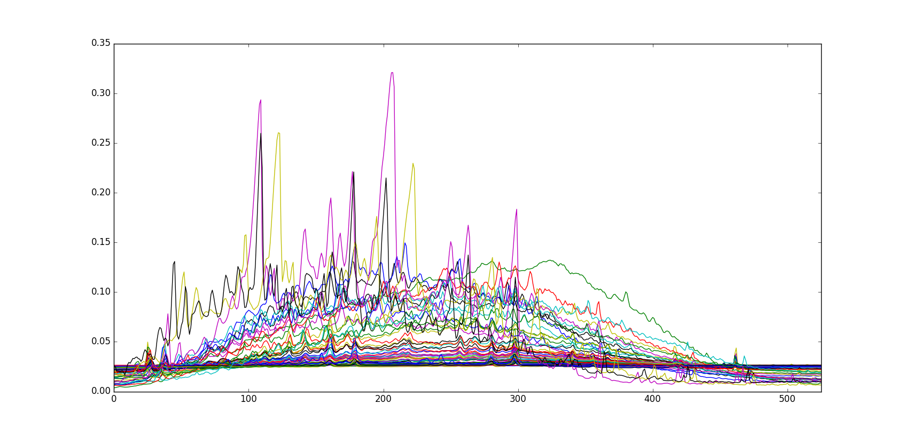

======
GC Mud
======

Overview
########
Gas Chromatography spectral data set of mud samples

Name
####
GC Mud

Id
##
`gc_mud`

Description
###########
The data contains 77 chromatograms with 527 variables (chromatographic peaks).
Originally there were 3000, reduced as described above. In addition we have
deleted other variables with little information, so that you can analyze the
data even if your PC has little memory.

Source
######
- Page 109 of the book `Multivariate Data Analysis in Practice`.

Remarks
#######
.. note::
    - PCA can be used to look for patterns in a large data set, and investigate the use of different scaling techniques.

    - 77 mud samples were collected and their chromatograms recorded. About 3000 peaks were reduced to 1041 by maximum entropy pretreatment in a selected chromatographic retention interval. Normally several of the peaks are integrated, but this does not really catch all the important variations. In addition it may be difficult to compare many chromatograms and interpret the variations.

