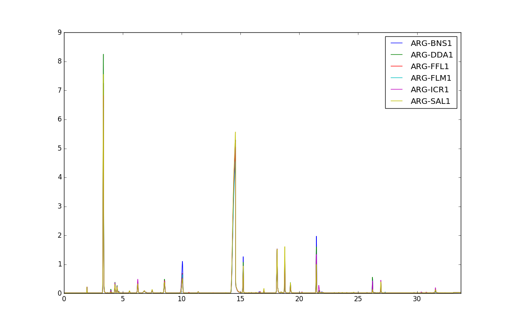

========
GC Wines
========

Overview
########
Gas Chromatography spectral data set of wines samples.

Name
####
GC Wines

Id
##
`gc_wines`

Description
###########
This data set contains Gas Chromatography information of wine samples of different
origins.

    :No. of samples:
        44
    :No. of features:
        2700 numeric attributes, 1 attribute associated with wine origin

Source
######
- `Data set in Rasmus Bro's website <http://www.models.life.ku.dk/Wine_GCMS_FTIR>`_

References
##########
.. note::
    - `T. Skov, D. Balabio, R. Bro (2008). Multiblock Variance Partitioning. A new approach for comparing variation in multiple data blocks. Analytica Chimica Acta, 615 (1): 18-29`.
