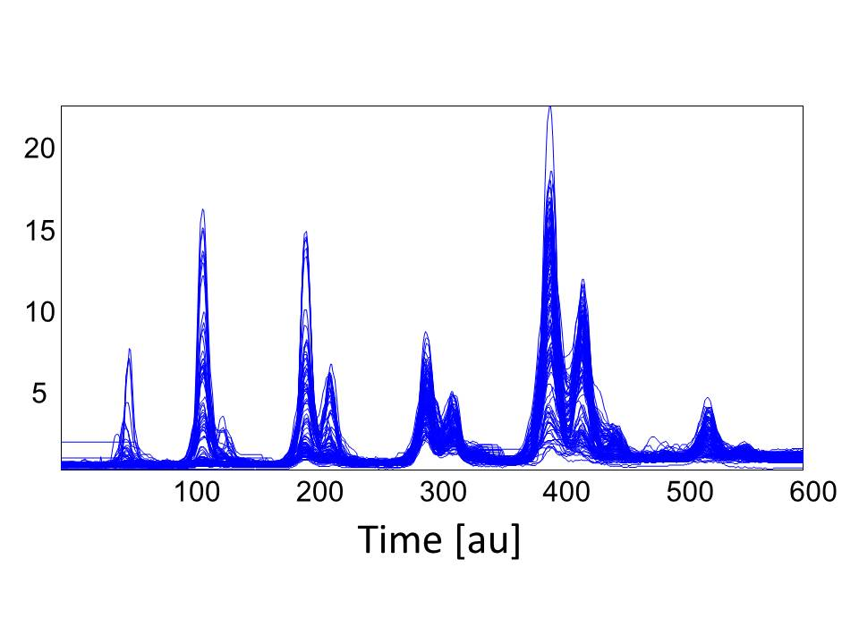

========
HPLC Oil
========

Overview
########
HPLC spectral data set of oil samples.

Name
####
HPLC Oil

Id
##
`hplc_oil`

Description
###########

Data consists of 120 oil samples analyzed by HPLC coupled to a charged aerosol detector. Of the oil samples,
68 are various types and grades of olive oils and the remaining either non-olive vegetable oils or non-olive
vegetable oils mixed with olive oil. The HPLC method is aimed at providing a triacylglyceride profile. The
triacylglycerides are known to have a distinct pattern for olive oils.

    :No. of samples:
        120
    :No. of features:
        4001 numeric attributes, 2 associated with classes

The data was baseline corrected and
aligned as described in the original work and the resulting data after removal of a few outliers is shown
in the figure below.

Source
######
- `Data set in Rasmus Bro's website <http://www.models.life.ku.dk/oliveoil>`_

Remarks
#######
.. note::
    - Base line correction was necessary, also an alignment algorithm was applied and some outliers were removed.

References
##########
.. note::
    - `de la Mata-Espinosa P, Bosque-Sendra JM, Bro R, Cuadros-Rodriguez L, Discriminating olive and non-olive oils using HPLC-CAD and chemometrics, Analytical and Bioanalytical Chemistry, 2011a, 399, 2083-2092`.
    - `de la Mata-Espinosa P, Bosque-Sendra JM, Bro R, Cuadros-Rodriguez L, Olive oil quantification of edible vegetable oil blends using triacylglycerols chromatographic fingerprints and chemometric tools, Talanta, 2011b, 85, 177-182`.
