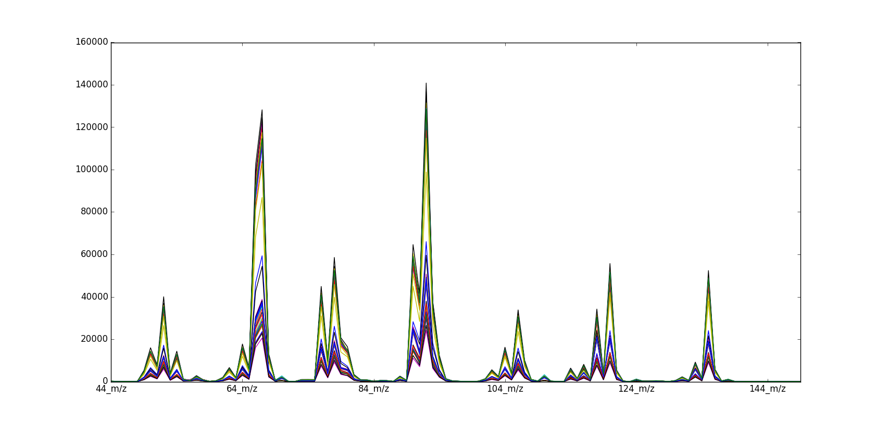

=======
MS Cola
=======

Overview
########
Mass Spectrometry spectral data set of soda samples.

Name
####
MS Cola

Id
##
`ms_cola`

Description
###########
Este es un caso típico de tratar de distinguir entre refrescos  suaves y fuertes
tanto en tipo de refrescos regulares como dietéticos a partir de sus espectros de masa.

.. note::
    - El data set puede ser utilizado para la **exploración de datos**.
    - El data set puede ser utilizado para la **clasificación de bebidas** (dataset etiquetado).

:No. of samples:
    44
:No. of features:
    106 numeric attributes, 1 attribute associated with classes

Source
######
- `Sitio web del Software Unscrambler <http://www.camo.com/rt/Products/Unscrambler/unscrambler.html>`_ y/o su entrada en `Wikipedia <https://en.wikipedia.org/wiki/The_Unscrambler>`_.

Remarks
#######
.. note::
    - Es un dataset donde la descripción de las muestras son discontinuas (espectros de masa).
    - Pudiera ser utilizado con propósitos de validar una medida de disimilitud mediante resultados de clasificación.
    - Puede ser útil para probar medidas de disimilitud sobre datos espectrales no continuos.
    - Puede ser utilizado con propósitos de agrupamiento basado en proximitudes.
