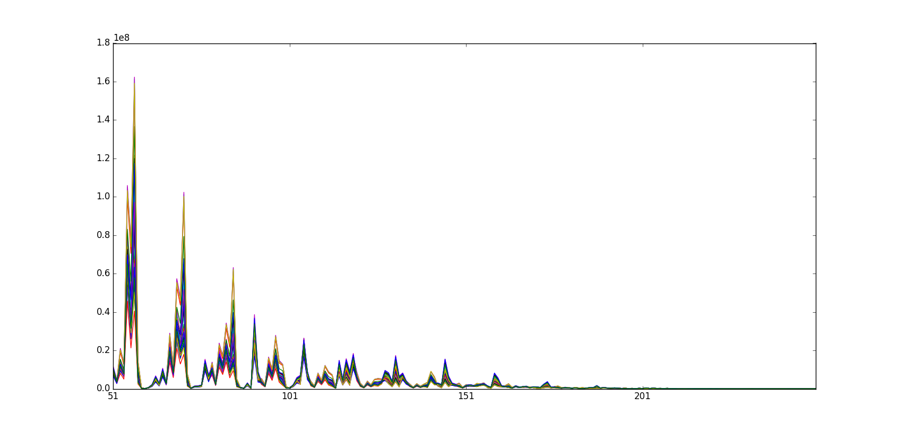
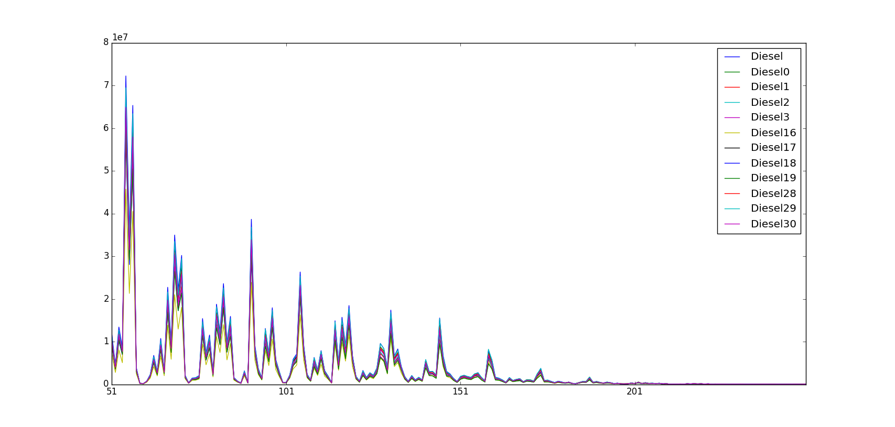

=========
MS Diesel
=========

Overview
########
Mass Spectrometry spectral data set of diesel samples.

Name
####
MS Diesel

Id
##
`ms_diesel`

Description
###########
El data set contiene espectros de masa de diesel puros, kerosinas puras y mezclas
de estos dos combustibles. El objetivo es construir un modelo de regresión  para
detectar la presencia y predecir cuantitativamente el nivel de  kerosina añadida
al diesel.

El dataset consta de 44 muestras y 202 variables (200 independientes, 1
dependiente-% Kerosine- y una variable asociada a clase).

:No. of samples:
    44
:No. of features:
    202 numeric attributes, 1 attribute associated with classes, 1 attribute associated with properties

.. note::
    - El data set puede ser utilizado para la **predicción de composición en DIESEL**.
    - El data set puede ser utilizado para la **clasificación de DIESEL** (dataset etiquetado).
    - El data set puede ser utilizado para la **calibración/regresión** (variable % Kerosine).

A continuación se puede observar la Clase 1 del data set.

Source
######
- `Sitio web del Software Unscrambler <http://www.camo.com/rt/Products/Unscrambler/unscrambler.html>`_ y/o su entrada en `Wikipedia <https://en.wikipedia.org/wiki/The_Unscrambler>`_.

Remarks
#######
.. note::
    - Es un dataset donde la descripción de las muestras son discontinuas (espectro de masa).
    - Puede ser útil para probar medidas de disimilitud sobre datos espectrales no continuos (usar las clases presentes).
    - Puede ser utilizado con propósitos de agrupamiento basado en proximitudes (usar las clases presentes).
