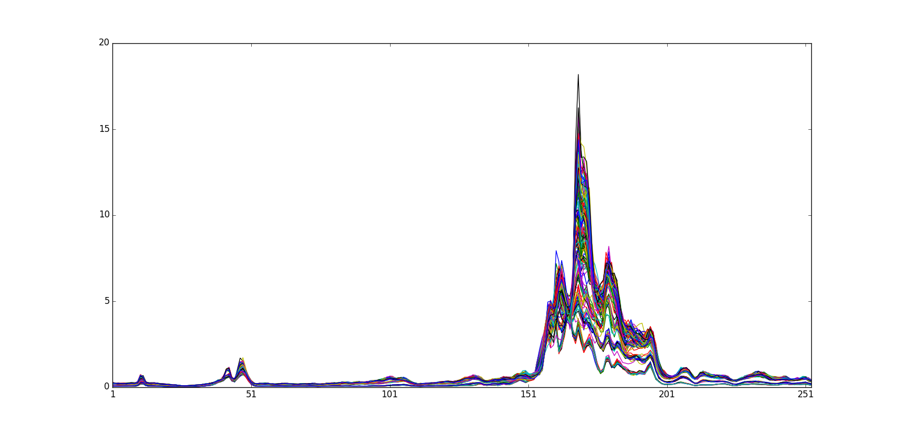

=========
MS Glycol
=========

Overview
########
Mass Spectrometry spectral data set of acoustic chemometrics for detecting glycol concentration.

Name
####
MS Glycol

Id
##
`ms_glycol`

Description
###########
The file 'glycol1-dataset.mat' contains 256 training spectra; note 18 replicates
for each concentration in the general glycol interval between 0.0% (corresponding to
pure Gardennoen groundwater) and 3.0%, which is the range of interest for the
Norwegian pollution authorities. The acoustic frequencies range between O-25 kHz,
which is probably severe frequency overkill. From our combined acoustic chemometrics
experiences one is led to expect that one, or more, coherent frequency-bands embedded
in this overall broad band signal would be optimal to do the job of quantifying the
concentration of glycol.

There is also a completely pristine test set to be found for the Glycol1 data set!
This is called Glycol2 (in file 'glycol2-dataset.mat') (which in fact carries a
different number of replicates).

Glycol1:
    :No. of samples:
        162
    :No. of features:
        253 numeric attributes, 1 attribute (kons) associated with properties

Glycol2:
    :No. of samples:
        126
    :No. of features:
        255 numeric attributes, 1 attribute (kons) associated with properties

.. image:: _images/ms_glycol2_data_plot.png
    :width: 800px
    :align: center
    :alt: The MS Glycol 2 data set.

Source
######
- Page 321 of the book `Multivariate Data Analysis in Practice`.

Remarks
#######
.. note::
    - [Glycol1] El data set consta de datos espectrales en forma de señales.
    - [Glycol1] Propósito de regresión/calibración.
    - [Glycol1] Pudiera ser utilizado para clasificación si se determinan clases a partir de los valores de la variable dependiente.
    - [Glycol1] Puede ser utilizado para evaluar medidas de disimilitud y para agrupar basado en proximidades. (las clases pueden ser determinadas a partir de la variable dependiente y los posibles umbrales para su valor).

.. note::
    - [Glycol2] El data set consta de datos espectrales en forma de señales.
    - [Glycol2] Propósito de regresión/calibración.
    - [Glycol2] Puede ser combinado con el data set Glycol1.
    - [Glycol2] Pudiera ser utilizado para clasificación si se determinan clases a partir de los valores de la variable dependiente.
    - [Glycol2] Puede ser utilizado para evaluar medidas de disimilitud y para agrupar basado en proximidades. (las clases pueden ser determinadas a partir de la variable dependiente y los posibles umbrales para su valor).
