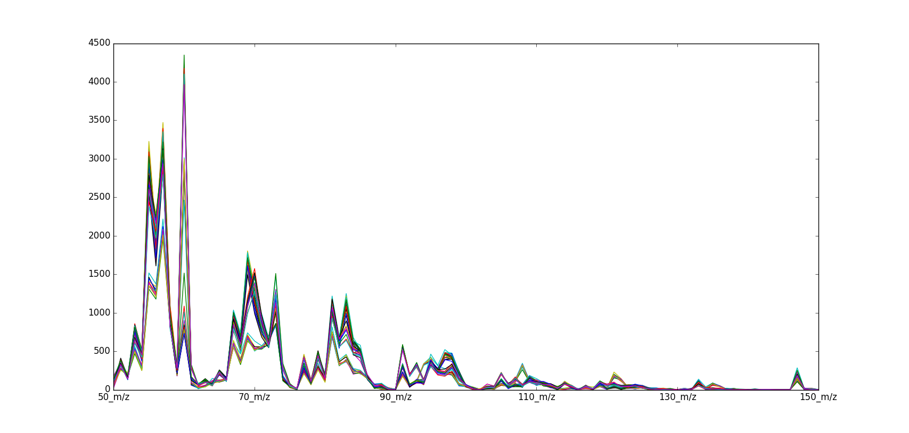
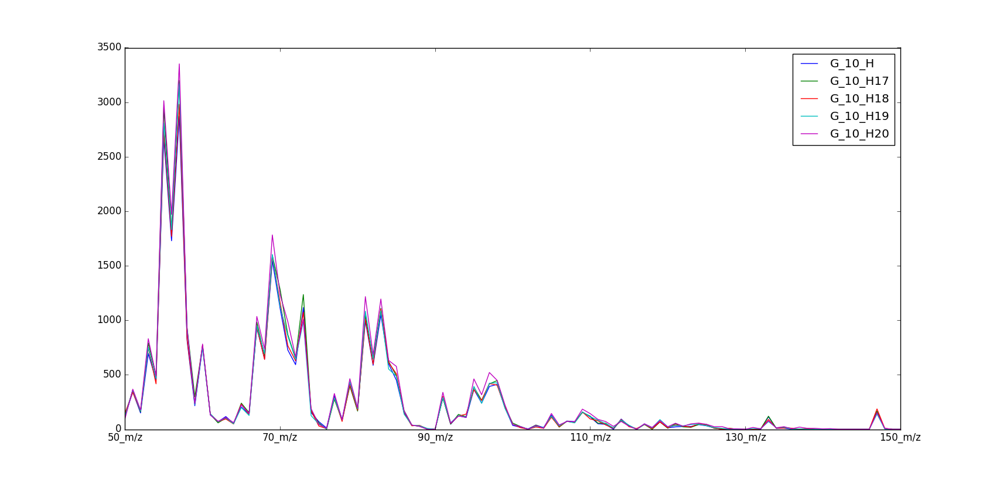

============
MS Olive Oil
============

Overview
########
Mass Spectrometry spectral data set of olive oil samples

Name
####
MS Olive Oil

Id
##
`ms_olive_oil`

Description
###########
Data set para distinguir rápidamente los aceites de oliva. El primer problema es
lograr hacer corresponder los aceites con su país de procedencia usando los
espectros de masa.

Además el aceite Hatzelnut  un adulterante potencial ha sido añadido en 2
concentraciones a algunas muestras de aceite de oliva de Grecia. Es necesario detectar
los aceites adulterados.

El data set consta de 40 muestras y 102 variables (101 variables independientes
y 1 variable dependiente asociada a pertenencia a clase).

    :No. of samples:
        40
    :No. of features:
        101 numeric attributes, 1 attribute associated with classes

The samples of class 5 are shown next.

Source
######
- `Sitio web del Software Unscrambler <http://www.camo.com/rt/Products/Unscrambler/unscrambler.html>`_ y/o su entrada en `Wikipedia <https://en.wikipedia.org/wiki/The_Unscrambler>`_.
