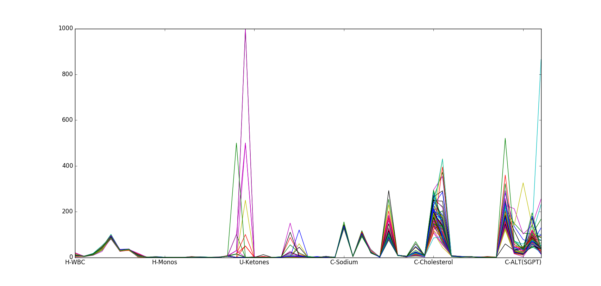
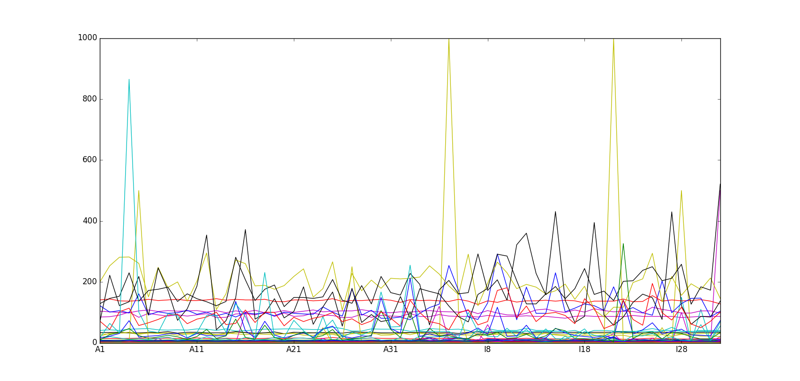

============
MVDA Alcohol
============

Overview
########
Alcohol in medical applications.

Name
####
MVDA Alcohol

Id
##
`mvda_alcohol`

Description
###########
El dataset contiene el resultado de analisis de sangre y orina de dos grupos de pacientes en un
hospital, ambos en un programa de tratamiento contra el alcoholismo. Un grupo tiene los alcohólicos
y el otro tiene los no alcohólicos. El objetivo es distinguir o separar ambos grupos a partir de
los datos de los análisis.

El propósito del data set es la exploración de datos y la clasificación de enfermedades (2 clases-A e I-).
Consiste de 65 muestras con 53 variables por cada muestra, y una variable asociada a clase.

    :No. of samples:
        65
    :No. of features:
        53 numeric attributes, 1 attribute associated with classes

The behavior of the data set properties is shown in the next figure.

Source
######
- `Sitio web del Software Pirouette <https://infometrix.com/pirouette/>`_.

Remarks
#######
.. note::
    - Puede ser utilizado con propósitos de validación de un agrupamiento (existen 2 clases).
    - Útil para probar medidas de disimilitud sobre datos espectrales no continuos.
