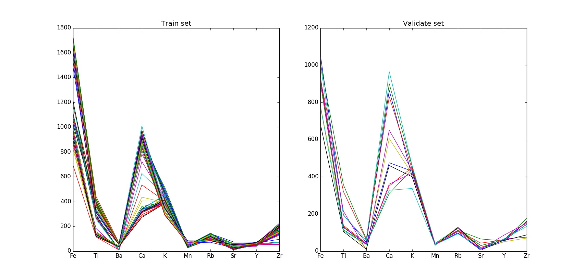
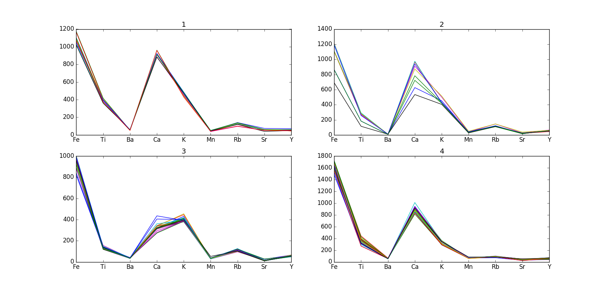

===============
MVDA Archeology
===============

Overview
########
Archeology. X-Ray Fluorescence.

Name
####
MVDA Archeology

Id
##
`mvda_arch`

Description
###########

The data set contains the result of studies performed over archeological samples gathered in 4
different locations. It was determined the presence of 10 inorganic compounds by means of X-Ray
fluorescence.

The original purpose of this data set was to create a classification model from the train
data (63 samples) and later use it for prediction of the validation data (12 samples)
gathered in 3 of those locations.

Train:
    :No. of samples:
        63
    :No. of features:
        10 properties, 1 attribute associated with class

Validate:
    :No. of samples:
        12
    :No. of features:
        10 properties, 1 attribute associated with class

The MVDA Archeology data set can be observed in the next figure.

The data for each `quarry` can be observed next.

Source
######
- `Sitio web del Software Pirouette <https://infometrix.com/pirouette/>`_.

Remarks
#######
.. note::
    - Can be used for data exploration.
    - Can be used for validating dissimilarity measures for non-spectral chemical data.

References
##########
.. note::
    - `Kowalski, et al. Kowalski, B.R.; Schatzki, T.F. and Stross, F.H. “Classification of Archaeological Artifacts by Applying Pattern Recognition to Trace Element Data.” Anal. Chem. (1972) 44: 2176`.
