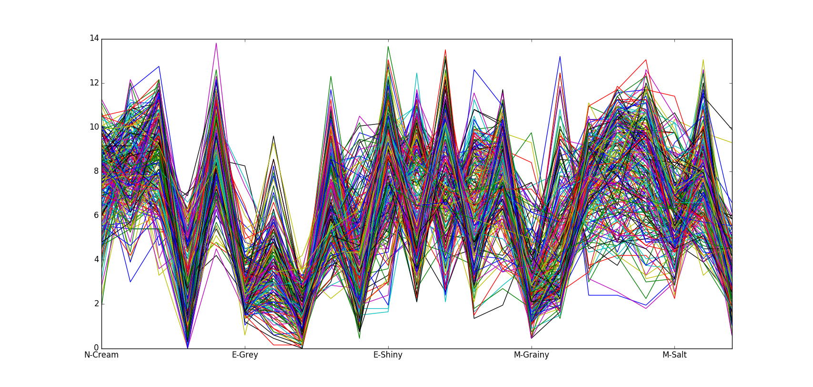
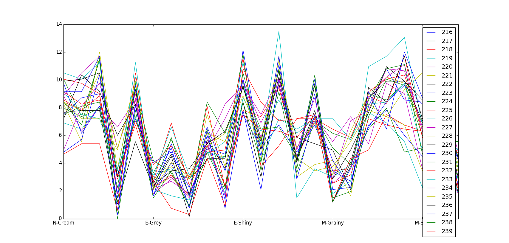

=================
MVDA Cream Cheese
=================

Overview
########
Creaminess of cream cheese.

Name
####
MVDA Cream Cheese

Id
##
`mvda_cream_cheese`

Description
###########
The data set has 240 samples and 23 different properties were measured for each one of these samples.

:No. of samples:
    240
:No. of features:
    23 properties, 6 attributes of additional information

The behavior of the P-Aroma property is shown in the next figure.

Source
######
- `Data set in Rasmus Bro's website <http://www.models.life.ku.dk/Cream>`_.

Remarks
#######
.. note::
    - The data set does not consists of spectral data. However, it is useful for traditional MVDA chemical analysis.
    - Can be used with proximity clustering purposes, as there is some information associated with judges, study replicas, etc.

References
##########
.. note::
    - `The influence of fat content on sensory properties and consumer perception of dairy products" (M. B. Frøst)`.
