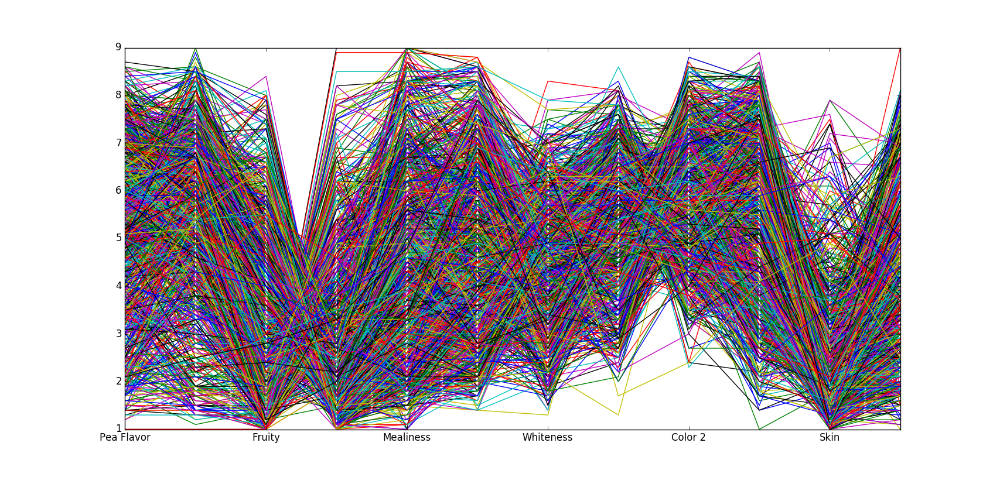
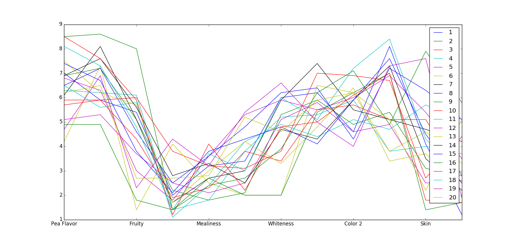

=============
MVDA Peas Raw
=============

Overview
########
Quality of Green Peas.

Name
####
MVDA Peas Raw

Id
##
`mvda_peas_raw`

Description
###########
The data set has the size 1200 samples times 15 variables. The first three variables identify the
samples. You can see that each of the ten judges (3-12) has tasted each sample twice for 12
variables, and that there are 20 recordings (samples) for each sample number.

:No. of samples:
    1200
:No. of features:
    15 properties

The behavior of the properties is shown in the next figure.

.. image:: _images/mvda_peas_raw_props_behavior.png
    :width: 800px
    :align: center
    :alt: MVDA Peas Raw data set properties behavior.

Next, Sample 1 behavior can be observed.

Source
######
- `Sitio web del Software Unscrambler <http://www.camo.com/rt/Products/Unscrambler/unscrambler.html>`_ y/o su entrada en `Wikipedia <https://en.wikipedia.org/wiki/The_Unscrambler>`_.

Remarks
#######
.. note::
    - It can be considered as a **multi-way** data set, as stated originally.
    - Can be used for data exploration.
    - Can be used for validating dissimilarity measures (classes can be determined by judge, sample, etc.)
    - Can be used for proximity-based clustering.
