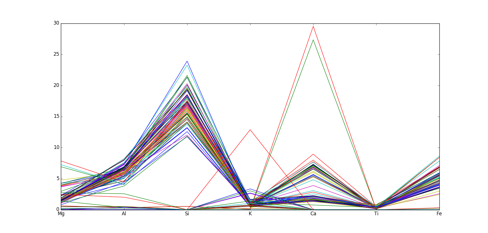

=========
MVDA Soil
=========

Overview
########
Inorganic characterization of Soils.

Name
####
MVDA Soil

Id
##
`mvda_soil`

Description
###########
The data set consists of 65 samples of soils aimed at developing a classification model, and 11
additional samples for external validation. Seven (7) inorganic properties were measured.

Train:
    :No. of samples:
        66
    :No. of features:
        7 properties, 1 attribute associated with class

Validate:
    :No. of samples:
        15
    :No. of features:
        7 properties, 1 attribute associated with class

The following classes can be found in the data:

.. attention::
    - **Fersialíticos Rojo Parduzco Ferromagnesial Típico (fm)**.
    - **Fersialíticos Pardo Rojizo Típico (ft)**
    - **Pardos sin Carbonatos Típico (ps)**
    - **Pardo con Carbonatos Típico (pt)**
    - **Pardos con Carbonatos Plastogénicos (pp)**
    - **Rendzina Roja Típica (r)**
    - **Aluvial Poco Diferenciado (a)**
    - **Esquelético Natural (e)**
    - **Arenas (ar)**

.. warning::
    - **One (1)** class description (soil of type **s**) was not found in the Thesis (extracted from Chapter 2).

The MVDA Soil data set can be observed in the next figure.

Classes can be observed next.

.. image:: _images/mvda_soil_classes_plot.png
    :width: 800px
    :align: center
    :alt: MVDA Soil classes plot.

Source
######
- MsC. Thesis of Isis Madrazo Armenteros (Isneri's student).

Remarks
#######
.. note::
    - Can be used for data exploration.
    - Can be used for validating dissimilarity measures.
    - Can be used for proximity-based clustering.
