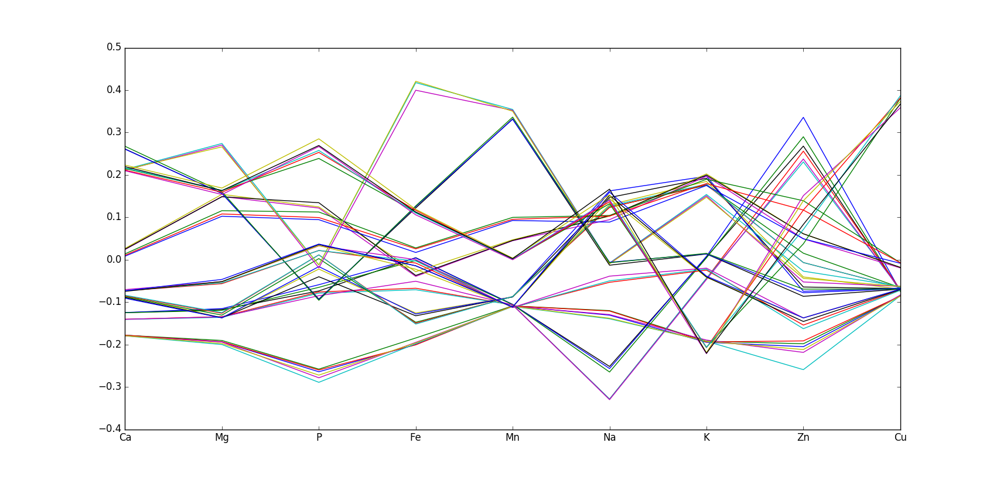
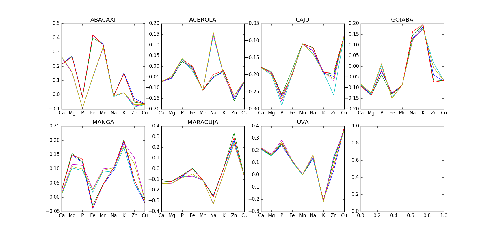

==========
MVDA Sucos
==========

Overview
########
Presence of minerals in juices of several fruits.

Name
####
MVDA Sucos

Id
##
`mvda_sucos`

Description
###########
The data set has the size 42 samples times 9 variables. All variables are measurements of several
mineral components that `identify` the samples. There is 1 extra variable associated with class
labels (The class are determined by type of fruit).

:No. of samples:
    42
:No. of features:
    9 properties

The MVDA Sucos data set can be observed in the next figure.

Classes can be observed next.

Source
######
- Tutorial on Data Exploration by PhD. Marcia.

Remarks
#######
.. note::
    - Data is already **autoscaled**.
    - Can be used for data exploration.
    - Can be used for validating dissimilarity measures.
    - Can be used for proximity-based clustering.

References
##########
.. note::
    - `Morgano, M. A., Queiroz, S. C. N., Ferreira, M. M. C. “ Determinação dos teores de minerais em sucos de frutas por espectrometria de emissão ótica em plasma indutivamente acoplado (ICP-OES)”. Ci. Tecnol. Alim., U19U, 344-348 (1999)`.