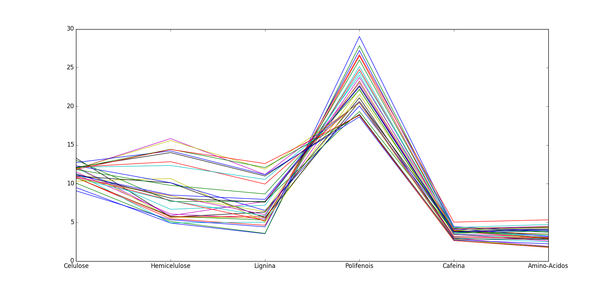
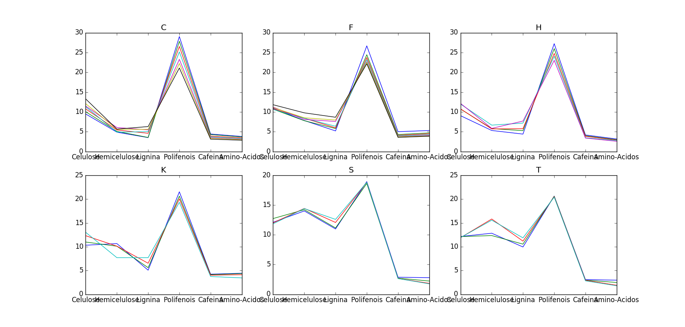

========
MVDA Tea
========

Overview
########
Types of Tea.

Name
####
MVDA Tea

Id
##
`mvda_tea`

Description
###########
The data sets consists of some tea varieties and origins. The goal is to identify such tea types and
varieties using a chemical analysis and chemometrics.

In the study, there are 2 different varieties for each one of the 3 categories of tea:

.. note::
    - **Black:** K e F
    - **Green:** C e H
    - **Oolong:** S e T

:No. of samples:
    31
:No. of features:
    6 properties

The MVDA Tea data set can be observed in the next figure.

Classes can be observed next.

Source
######
- Tutorial on Data Exploration by PhD. Marcia.

Remarks
#######
.. note::
    - Data is already **autoscaled**.
    - Can be used for data exploration.
    - Can be used for validating dissimilarity measures (classes can be determined by judge, sample, etc.)
    - Can be used for proximity-based clustering.

References
##########
.. note::
    - `Liu, X; Van Espen, P.; Adam, F. ‘Classification of chinese tea samples according to origin and quality by principal component techniques’ Analytica Chimica Acta 200 (1987) 421-430`.
