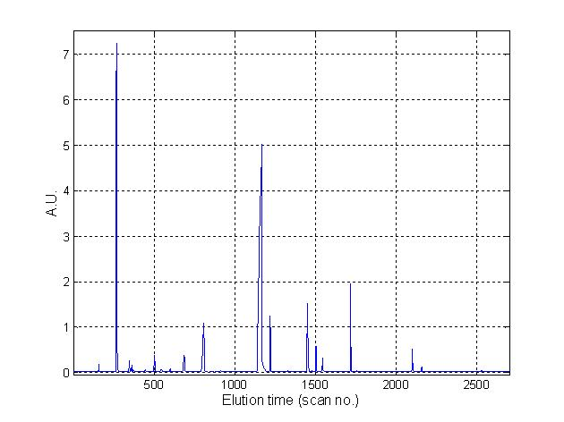
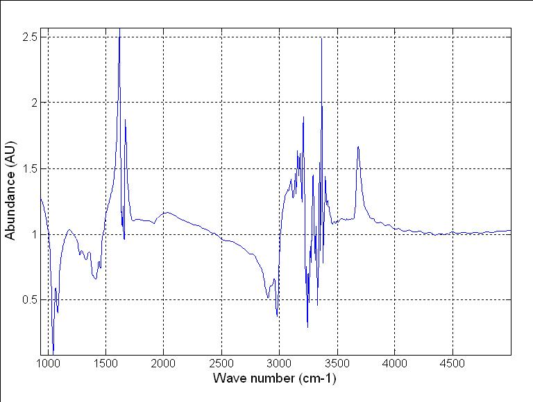

====================
MW GC-MS/FT-IR Wines
====================

Overview
########
Wine samples analyzed by GC-MS and FT-IR instruments.

Name
####
GC-MS/FT-IR Wines

Id
##
`mw_gc_ms_wines`

Description
###########
Multi-way data set contains Gas Chromatography, Mass Spectrometry and Infra-red Spectroscopy information
of wine samples of different origins.

    :No. of samples:
        44
    :No. of GC features:
        2700 numeric attributes, 1 attribute associated with wine origin
    :No. of MS features:
        200 numeric attributes, 1 attribute associated with wine origin
    :No. of IR features:
        843 numeric attributes, 1 attribute associated with wine origin

Source
######
- `Data set in Rasmus Bro's website <http://www.models.life.ku.dk/Wine_GCMS_FTIR>`_

References
##########
.. note::
    - `T. Skov, D. Balabio, R. Bro (2008). Multiblock Variance Partitioning. A new approach for comparing variation in multiple data blocks. Analytica Chimica Acta, 615 (1): 18-29`.
