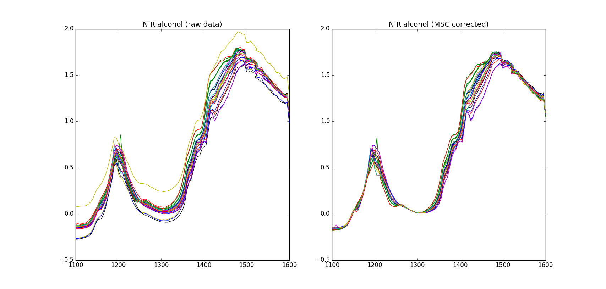

===========
NIR Alcohol
===========

Overview
########
NIR Spectroscopy of mixed alcohol samples.

Name
####
NIR Alcohol

Id
##
`nir_alcohol`

Description
###########
Spectroscopic transmission data (NIR) over 101 wavelengths from a specific
instrument (Guided Wave, Inc.). The samples are characterized by different
mixing proportions of the three alcohols methanol, ethanol and propanol,
always adding up to 100%. The three pure alcohols are also included.

The spectra have been transformed to absorbance units. No single
wavelength can be used alone, because of strongly overlapping spectra.
NIR spectra of mixtures may often exhibit scatter effects due to interference.
This causes shifts in the spectra, which is often a very big obstacle in the
multivariate calibration game. But this can be corrected for by MSC.

The total sample set, called Training (27 samples), and variable sets, Spectra
(101 wavelengths) and Concentrations (three Y-variables) are used in the
calibration. The first 16 samples (Al - A16) should be used as calibration samples.
Samples 17-27 (B1-B11) should be used as test samples to validate the model.

The sample set New may be used for prediction. The sample set MSCorrected
contains MSC transformed spectra for comparison.

Train:
    :No. of samples:
        27
    :No. of features:
        101 attributes, 3 properties

New:
    :No. of samples:
        13
    :No. of features:
        101 attributes, 3 properties

MSC:
    :No. of samples:
        27
    :No. of features:
        101 attributes, 3 properties

Source
######
- `Sitio web del Software Unscrambler <http://www.camo.com/rt/Products/Unscrambler/unscrambler.html>`_ y/o su entrada en `Wikipedia <https://en.wikipedia.org/wiki/The_Unscrambler>`_.

Remarks
#######
.. note::
    - Can be used to test dissimilarity measures over mildly-smooth continuous spectra.
    - Can be used to test dissimilarity measures that take into account (in their mathematical formulation) a MSC pre-processing.
    - Can be used for proximity-based clustering.
    - Ground truth (labels) can be determined from an exploratory analysis of dependent variables.

References
##########
.. note::
    - This particular application has also previously been used by `Martens & Naes in their textbook Multivariate Calibration`.
