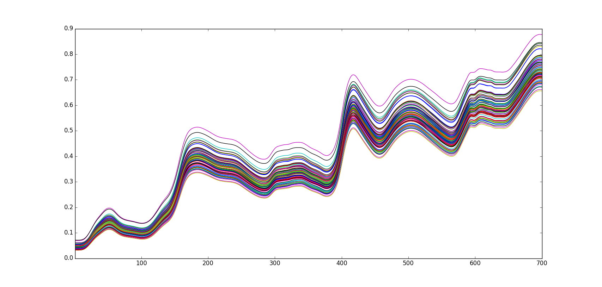

========
NIR Corn
========

Overview
########
NIR Spectrometry of corn samples for standardization benchmarking.

Name
####
NIR Corn

Id
##
`nir_corn`

Description
###########
This data set consists of 80 samples of corn measured on 3 different NIR
spectrometers. The wavelength range is 1100-2498nm at 2 nm intervals (700 channels).
The moisture, oil, protein and starch values for each of the samples is also
included. A number of NBS glass standards were also measured on each instrument.
The data was originally taken at Cargill. Many thanks for Mike Blackburn for
letting us distribute it.

The data is described below:

    ============== ================================ ================================
    Data name      Data dimensions (rows x columns) Data information
    ============== ================================ ================================
    m5spec           80x700                         Spectra on instrument m5
    mp5spec          80x700                         Spectra on instrument mp5
    mp6spec          80x700                         Spectra on instrument mp6
    propvals         80x4                           Property values for samples
    m5nbs            3x700                          NBS glass stds on m5
    mp5nbs           4x700                          NBS glass stds on mp5
    mp6nbs           4x700                          NBS glass stds on mp6
    ============== ================================ ================================

The samples of the NIR Corn data set on instrument m5 are shown next.

Source
######
- `Data set website in Eigenvector <http://www.eigenvector.com/data/Corn/index.html>`_.

Remarks
#######
.. note::
    - Can be used to test the quality of clustering algorithms
    - Can be used to test the quality and robustness of dissimilarity measures
    - Can be used to evaluate spectral preprocessing methods (SNV, etc.)
    - Can be used for regression purposes:
        - Hidration
        - Protein
        - Oil
        - Starch content