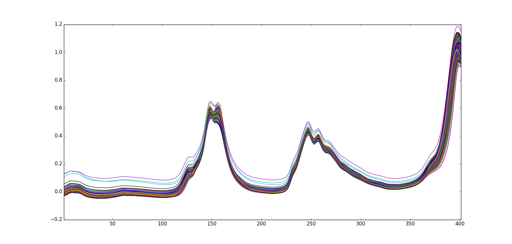
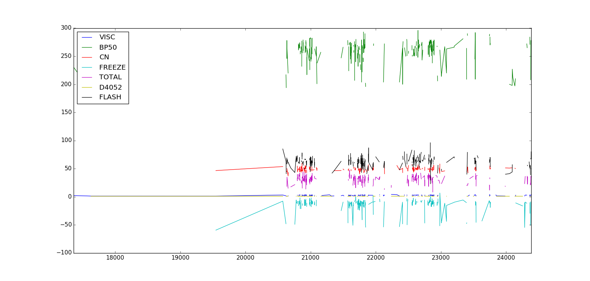

========
NIR Fuel
========

Overview
########
Near Infrared Spectra of Diesel Fuels.

Name
####
NIR Fuels

Id
##
`nir_fuels`

Description
###########
The data set consists of 784 samples of NIR Spectroscopy with 401 spectral bands of
diesel fuels. The author of this data set is Scott Hutzler (Southwest Research Institute).

For these samples, an additional 8 properties were measured:
    - bp50 - boiling point at 50% recovery, deg C (ASTM D 86)
    - CN - cetane Number (like Octane number only for diesel, ASTM D 613)
    - d4052 - density, g/mL, @ 15 deg C, (ASTM D 4052)
    - freeze - freezing temperature of the fuel, deg C
    - total - total aromatics, mass% (ASTM D 5186)
    - visc - viscosity, cSt, @ 40 deg C

.. note::
    - Only 7 properties were found in the data.

:No. of samples:
    784
:No. of features:
    401 attributes, 7 properties

It is important to stress that these spectral are **NOT pre-processed** and the properties
were **NOT measured for all the samples**. Therefore, there are some **missing values (NANs)**
in the data set.

The NIR Fuel data set is shown next.

The behavior of the properties on the NIR Fuel can be observed in the next figure.

Source
######
- `Data set website in Eigenvector <http://www.eigenvector.com/data/SWRI/index.html>`_.

Remarks
#######
.. note::
    - Can be used to test the quality and robustness of dissimilarity measures, but also to validate the new proposed ones.
    - Can be used for variable selection.
    - Can be used to test calibration algorithms.