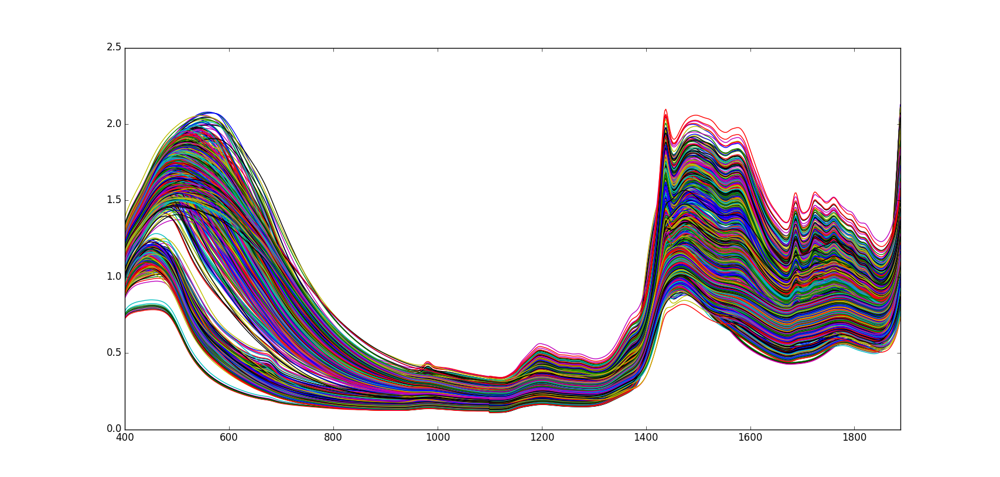
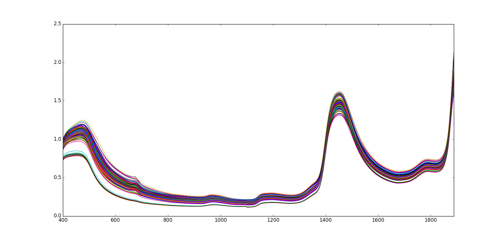

=============
NIR Sugarcane
=============

Overview
########
NIR Spectrometry of sugarcane data.

Name
####
NIR Sugarcane

Id
##
`nir_sugarcane`

Description
###########
NIR spectra for prediction of Brix and sucrose during sugar production. Data
originates from four process steps in a sugar factory: milling (juice),
evaporation (syrup), crystallization (massecuite) and centrifugation (molasses).
The latter two steps consisted of three sub-steps. 1797 samples were measured
at 400–1888nm with an increment of 2 nm. The reference values Brix (dissolved
solid content) and pol (sucrose) were measured as mass percentage.

The dataset contains nonlinear effects due to changes in the physical and
chemical constitution of the process stream during production such as
temperature, pH, viscosity, sample composition and crystals.

:No. of samples:
    1797
:No. of features:
    745 attributes, 2 properties, 3 attributes associated with classes

The NIR Sugarcane data set is shown next.

The samples belonging to the `juice` process step can be observed in the next figure.

Source
######
- `Data set in Rasmus Bro's website <http://www.models.life.ku.dk/nirsugarcanedata>`_.

Remarks
#######
.. note::
    - Can be used to test the quality and robustness of dissimilarity measures.
    - Can be used for clustering.
    - Stages are well defined.

References
##########
.. note::
    - `R. Tange et al., J. Near Infrared Spectrosc. 23, 75–84 (2015)`.
