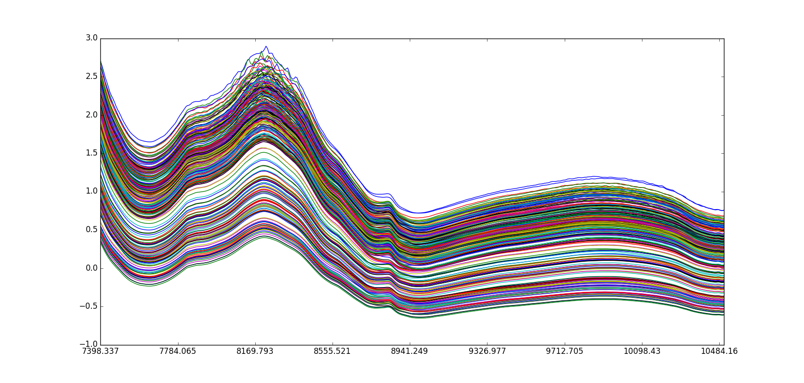
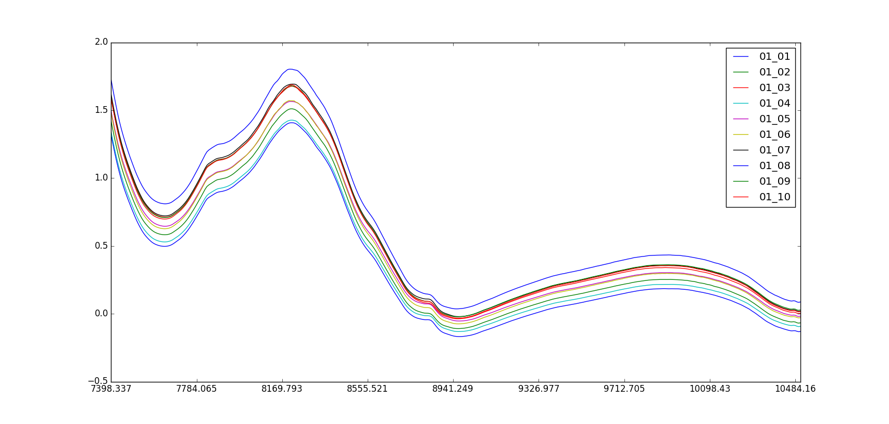

===========
NIR Tablets
===========

Overview
########
Active substance in pharmaceutical tablets.

Name
####
NIR Tablets

Id
##
`nir_tablets`

Description
###########
The data set is composed by near infrared (NIR) transmittance spectra of pharmaceutical tablets of
four different (classes) dosages of nominal content of active substance. In this data, the spectra
of the examples of the different classes are very similar, they variate in the intensity of only
one peak at 8830 :math:`cm^{−1}`. This peak corresponds to the only visually characteristic band
of the active substance.

.. note::
    - Near Infrared Transmittance; 404 variables; 7400 10507 cm 1
    - Relative active substance content (% w/w)
    - Production scale (laboratory, pilot, full)
    - Tablet type (A, B, C, D)

:No. of samples:
    310
:No. of features:
    404 attributes, 2 attributes (`Scale` and `Type`) associated with classes, 1 property (`% w/w`)

The NIR Tablets data set is shown next.

Some samples belonging to `Class 1` can be observed in the next figure.

Source
######
- `Data set in Rasmus Bro's website <http://www.models.life.ku.dk/tablets>`_.

Remarks
#######
.. note::
    - Multiplicative scatter correction (`MSC <http://wiki.eigenvector.com/index.php?title=Advanced_Preprocessing:_Sample_Normalization#MSC_.28Multiplicative_Scatter_Correction.29>`_) was used as preprocessing method.
    - It can be used for **classification**.
    - It can be used for testing the suitability of the **shape dissimilarity measure**.

References
##########
.. note::
    - `M. Dyrby, S.B. Engelsen, L. Nørgaard, M. Bruhn and L. Lundsberg Nielsen Chemometric Quantitation of the Active Substance in a Pharmaceutical Tablet Using Near Infrared (NIR) Transmittance and NIR FT Raman Spectra Applied Spectroscopy 56(5): 579 585 (2002)`.
