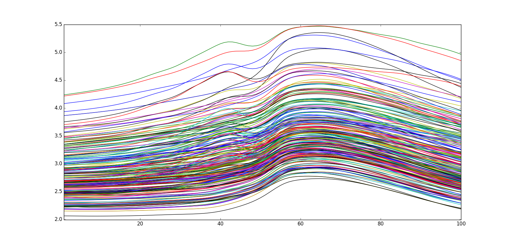
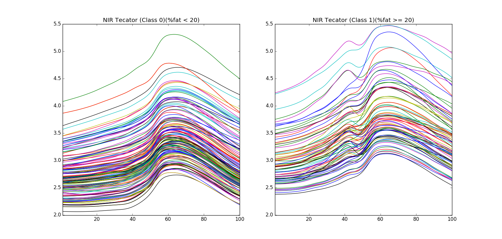

===========
NIR Tecator
===========

Overview
########
NIR absorbance spectra of meat examples.

Name
####
NIR Tecator

Id
##
`nir_tecator`

Description
###########
In this data, the examples of the two classes differ in their fat content, which is
reflected in changes in the shape of the spectra (structure).

.. note::
    - Near Infrared Absorbance; 100 variables.
    - Type (`fat<20`, `fat >= 20`)

:No. of samples:
    240
:No. of features:
    100 attributes, 1 attribute associated with classes, 1 property (`fat`)

The NIR Tecator data set is shown next.

Per class plots of the data set can be observed in the next figure.

Source
######
- Thodberg H.H. Danish Meat Research Institute. `Tecator dataset <http://lib.stat.cmu.edu/datasets/tecator/>`_.

Remarks
#######
.. note::
    - `SNV <http://wiki.eigenvector.com/index.php?title=Advanced_Preprocessing:_Sample_Normalization#SNV_.28Standard_Normal_Variate.29>`_ was used as preprocessing method.
    - It can be used for **classification**.
    - It can be used for testing the suitability of the **shape dissimilarity measure**.
