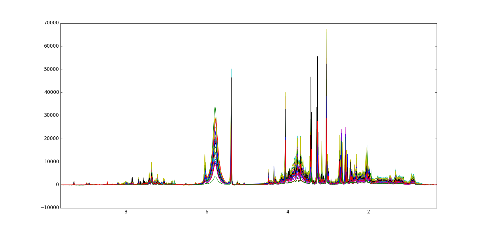
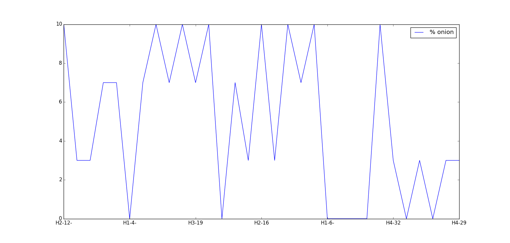

=========
NMR Onion
=========

Overview
########
1H-NMR spectral data set of onion samples

Name
####
1H-NMR Onion

Id
##
`nmr_onion`

Description
###########
The data originates from 1H NMR analysts of urine from thirty-two rats, fed a diet containing an onion by-product.
The aim is to evaluate the in vivo metabolome following intake of onion by-products. The rats are divided into
four classes (H1-H4) which corresponds to the onion amount in the feed.

The data set contains:
    - **X:** 31 x 29001 (NMR spectra in the region between 9.6 and 0.3 ppm).
    - **Y:** 31 x 17 (some reference chemical values).
    - **Samples_name:** 31 x 1 (Rat number including class).
    - **ppm:** 1 x 29001 (ppm scale from 9.6 to 0.3 ppm).
    - **onion:** 1 x 31 (% onion in the rat diet).

.. note::
    - The reference chemical values of **Y** were **NOT** found.

:No. of samples:
    31
:No. of features:
    29001 attributes, 1 attribute associated with classes and/or property

The NMR Onion data set is shown next.

The behavior of the property **% onion** can be observed in the next figure.

Source
######
- `Data set in Rasmus Bro's website <http://www.models.life.ku.dk/onionnmr>`_.

Remarks
#######
.. note::
    - No Y (reference chemical values) data could be found in the original .mat file.

References
##########
.. note::
    - `H. Winning, E. Roldán‐Marín, L.O. Dragsted, N. Viereck, M. Poulsen, C. Sánchez‐Moreno, M.P. Cano, S.B. Engelsen, An exploratory NMR nutri-metabonomic investigation reveals dimethyl sulfone as a dietary biomarker for onion intake, Analyst 2009, 134 (11) 2344-2351`.
