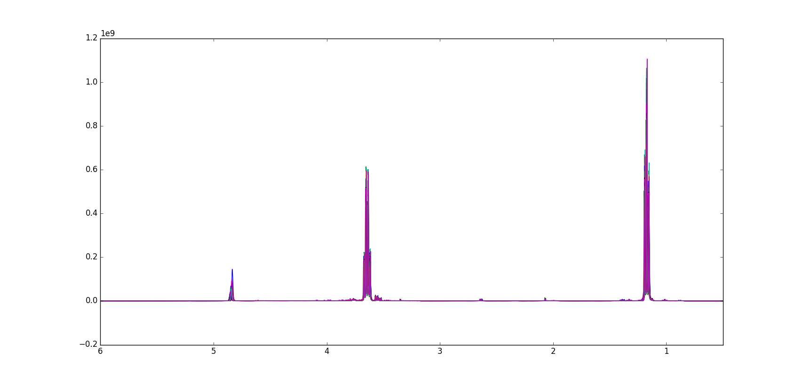
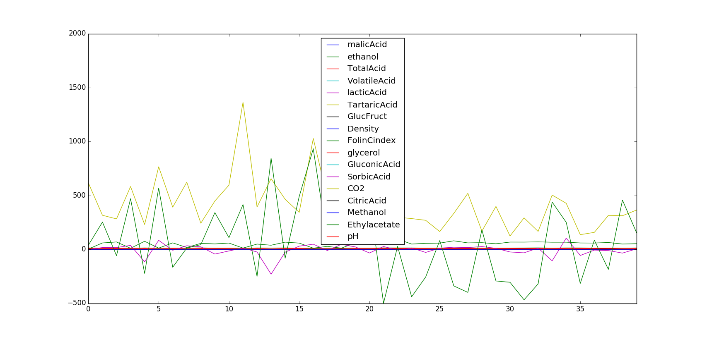

========
NMR Wine
========

Overview
########
1H-NMR spectral data set of wine samples.

Name
####
1H-NMR Wine

Id
##
`nmr_wine`

Description
###########
The data originates from 1H-NMR analysis of 40 table wines of different origin and color. No buffer and/or pH adjustment has been used prior to analysis therefore the spectra present a quite strong misalignment of the NMR resonance signals.

The data set contains:
    - **X:** 40 x 8712 (NMR wine dataset describing the NMR spectral region between 6.0 and 0.5 ppm)
    - **Y:** 40 x 17 (some reference chemical values)
    - **Label:** 1 x 17 cell (the labels of the chemical reference values)
    - **ppm:** 1 x 8712 (ppm scale from 6.0 to 0.5 ppm)
    - **wine_ints:** 1 x 22 (row vector for the definition of the customized intervals of intervention to sole the misalignment problems)

:No. of samples:
    40
:No. of features:
    8712 attributes, 17 properties

.. warning::
    - It is important to stress that some **alignment** might be needed.

The NMR Wine data set is shown next.

The behavior of the properties can be observed in the next figure.

Source
######
- `Data set in Rasmus Bro's website <http://www.models.life.ku.dk/Wine_NMR>`_.

References
##########
.. note::
    - `F.H. Larsen, F. van den Berg, S.B. Engelsen, An exploratory chemometric study of 1H-NMR spectra of table wines. J.Chemom. 20 (2006) 198-208`.
