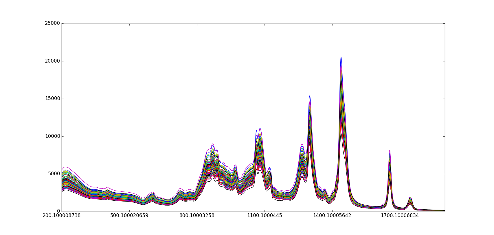
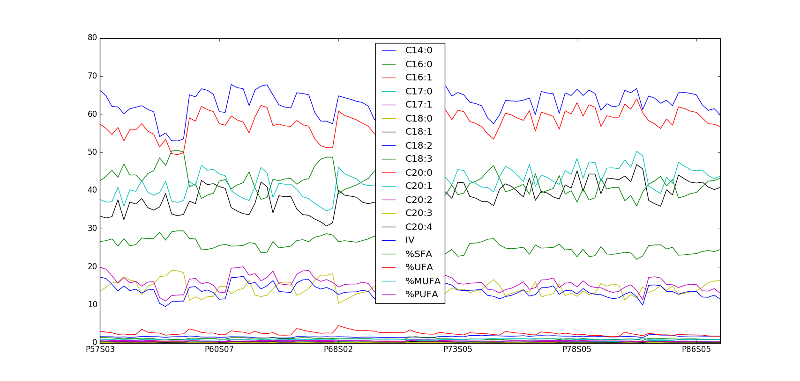

=============
Raman Porkfat
=============

Overview
########
Raman spectral data set of pork fat samples.

Name
####
Raman Pork Fat

Id
##
`raman_porkfat`

Description
###########
This data set contains Raman information of pork fat samples.

:No. of samples:
    105
:No. of features:
    5667 attributes, 3 attributes associated with classes, 19 properties

The Raman Porkfat data set is shown next.

The behavior of the properties can be observed in the next figure.

Source
######
- `Data set in Rasmus Bro's website <http://www.models.life.ku.dk/RAMANporkfat>`_.

References
##########
.. note::
    - `Lotte Bøge Lyndgaard, Klavs Martin Sørensen, Frans van den Berg and Søren Balling Engelsen (2012): Depth profiling of porcine adipose tissue by Raman spectroscopy, Journal of Raman Spectroscopy, 43, 482-489`.

Additional Links
################
.. note::
    - `<https://www.researchgate.net/post/How_to_normalize_raman_spectroscopy_data>`_
