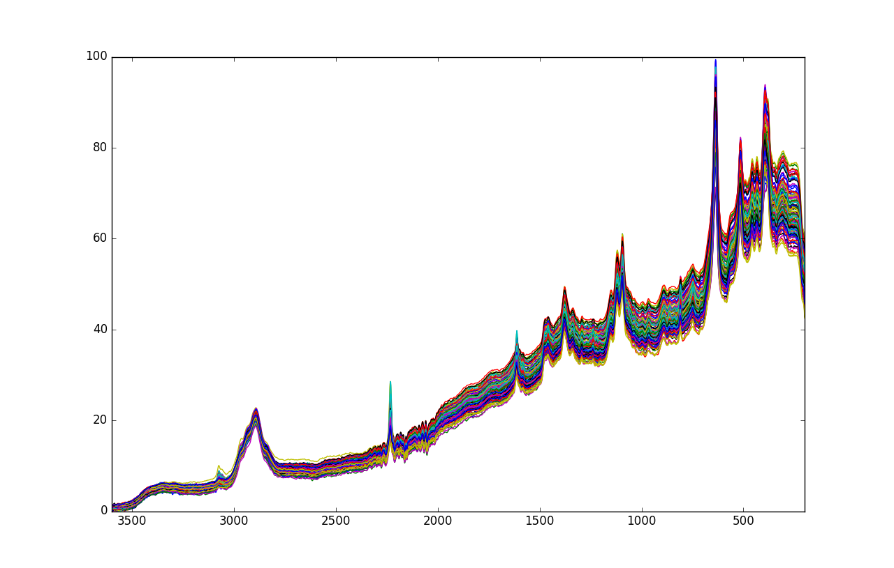
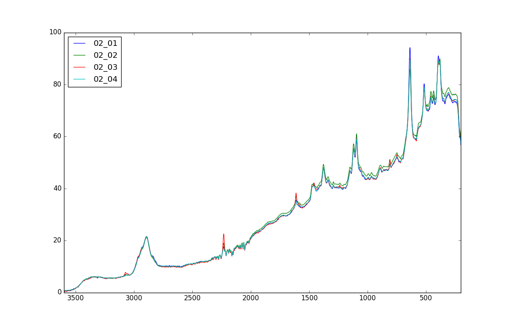

=============
Raman Tablets
=============

Overview
########
Active substance in pharmaceutical tablets.

Name
####
Raman Tablets

Id
##
`raman_tablets`

Description
###########
.. note::
    - NIR FT Raman; 3401 variables; 3600 200 cm 1
    - Relative active substance content (% w/w)
    - Tablet type (A, B, C, D)

:No. of samples:
    120
:No. of features:
    3401 attributes, 1 attributes (`Type`) associated with classes, 1 property (`% w/w`)

The Raman Tablets data set is shown next.

Some samples belonging to `Class 1` can be observed in the next figure.

Source
######
- `Data set in Rasmus Bro's website <http://www.models.life.ku.dk/tablets>`_.

References
##########
.. note::
    - `M. Dyrby, S.B. Engelsen, L. Nørgaard, M. Bruhn and L. Lundsberg Nielsen Chemometric Quantitation of the Active Substance in a Pharmaceutical Tablet Using Near Infrared (NIR) Transmittance and NIR FT Raman Spectra Applied Spectroscopy 56(5): 579 585 (2002)`.

Additional Links
################
.. note::
    - `<https://www.researchgate.net/post/How_to_normalize_raman_spectroscopy_data>`_
